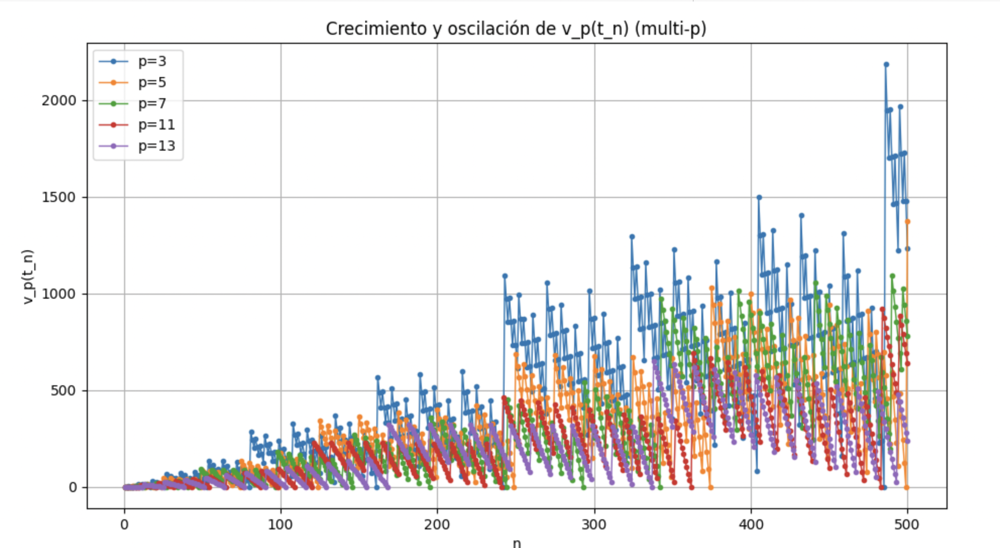
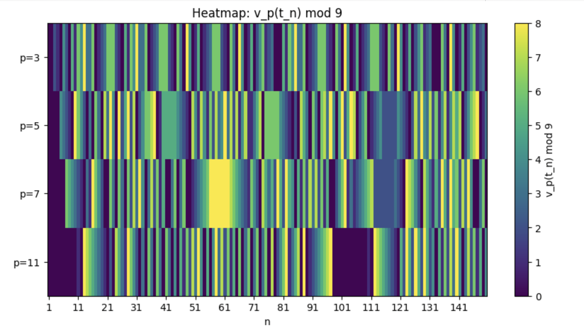
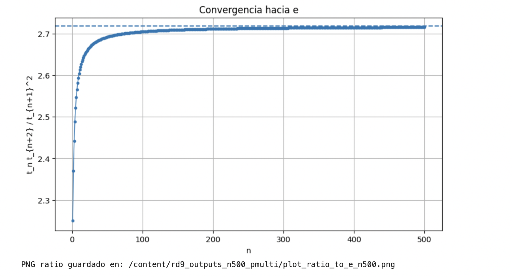
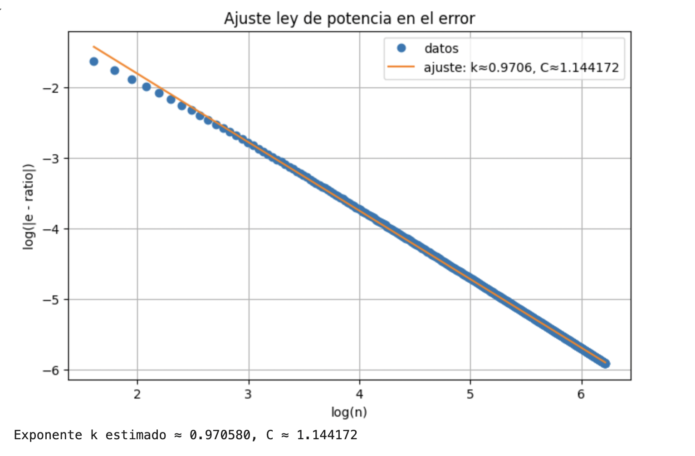

# Pascal_RD9

Fuentes LaTeX y figuras del artículo:

**"Triángulo de Pascal y RD9: Resonancia Local y Estructura p²-ádica mediante el Autómata de Resonancia"**  
**Autor:** Mauro Gonzalez Romero  

📥 **[Descargar PDF compilado](https://github.com/Menta2357/Pascal_RD9/releases/download/v1.0.0/Pascal_RD9_V2.pdf)**  
📦 **[Ver todas las versiones / releases](https://github.com/Menta2357/Pascal_RD9/releases)**

---

## 📄 Contenido
- `Pascal_RD9_V2.tex` — Fuente LaTeX del artículo.
- `Pascal_RD9_V2.pdf` — Versión compilada del artículo.
- `.gitignore` — Configuración para ignorar archivos temporales de LaTeX.
- `LICENCIA` — Licencia Creative Commons Attribution 4.0 International (CC BY 4.0).
- Carpeta `gráficos_colab/` — Contiene imágenes y resultados adicionales generados en Google Colab.

---

## 🛠 Cómo compilar
Para compilar el documento, asegúrate de tener instalado un entorno LaTeX (por ejemplo **TeX Live** o **MiKTeX**) y ejecuta:

```bash
pdflatex Pascal_RD9_V2.tex
# 📜 Licencia
Este trabajo está bajo **Creative Commons Attribution 4.0 International (CC BY 4.0)**.  
Puedes copiarlo, redistribuirlo y adaptarlo, incluso con fines comerciales, siempre que se dé el crédito apropiado al autor original.

[Ver texto completo de la licencia](https://creativecommons.org/licenses/by/4.0/)

---

# 📊 Gráficos adicionales
A continuación se presentan resultados adicionales generados en Google Colab que complementan el análisis del artículo.

## 1. Crecimiento y oscilación de \( v_p(t_n) \) para varios primos \(p\)
Evolución de la valoración \( v_p(t_n) \) para distintos primos \( p \), mostrando patrones de crecimiento y oscilación.



---

## 2. Mapa de calor de \( v_p(t_n) \bmod 9 \)
Distribución modular de \( v_p(t_n) \) para varios primos, representada en un heatmap para identificar patrones.



---

## 3. Triángulo de Pascal mod 9 por clases RD9
Visualización del triángulo de Pascal mod 9 coloreado según las clases RD9, mostrando su estructura fractal.


---

## 4. Convergencia hacia \( e \)
Gráfico que ilustra cómo una razón asociada a \( t_n \) converge hacia el número \( e \).



---

## 5. Ajuste ley de potencia en el error
Relación log-log entre el error y \( n \), con estimación del exponente \( k \) y la constante \( C \) del ajuste.


📥 **Descarga directa del PDF**:  
[Pascal_RD9_V2.pdf](https://github.com/Menta2357/Pascal_RD9/releases/download/v1.0.0/Pascal_RD9_V2.pdf)
